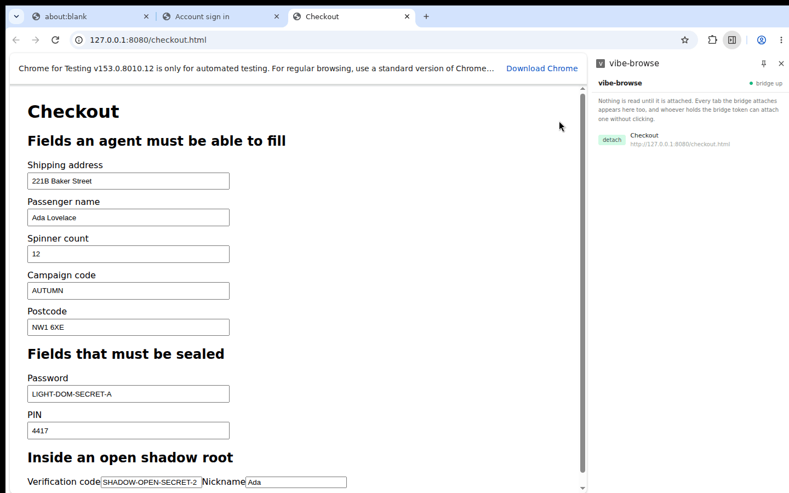

# vibe-browse

A Chrome extension that hands an AI agent the page's **accessibility tree** as a
tool-call interface, instead of a picture of the page.

```
   page                extension              agent
    |                      |                    |
    |--- AXTree ---------->|--- JSON tree ----->|
    |                      |                    |
    |<-- CDP Input --------|<-- {click, 12} ----|

  read:  Accessibility.getFullAXTree
  act:   DOM.getBoxModel  ->  Input.dispatchMouseEvent
```

The agent never sees the page. It sees a list of lines, each one element:

```
  12  button   "Sign in"
  13  textbox  "Email"
  14  textbox  ""           [password]
```

It answers with `{"action":"click","nodeId":12}`.



The panel on the right is the whole interface: a row per tab, attach or detach, and
whether the bridge is up. On the left is the page used to test it — everything under
*must be sealed* reaches the agent as `[password]`, everything above it reaches the
agent as itself.

## Why this is faster

A screenshot costs image tokens and still has to be guessed at. The same page as a
filtered tree is a few hundred tokens of text, each line naming what the element is
and how to reach it.

Measured on `tests/fixtures/ax-before.json`, a sign-in page of 42 nodes, 9 of them
interactive. Rebuild these numbers with `read()` and `query()` on that file.

| | per look |
|---|---|
| screenshot, 1440x900 | ~1,700 image tokens, positions inferred |
| whole tree | ~1,000 text tokens |
| tree, interactive only | **~280 text tokens, ids exact** |

About six times cheaper than the screenshot on this page, not the orders of magnitude
the pitch for this kind of thing usually claims. The ratio moves with the page: a form
heavy in controls narrows it, a wall of prose widens it.

There is no coordinate to get wrong, so a click lands on the element the agent named
or is refused. And a tree is cheap enough to re-read after every action, which is what
stops a ten-step task decaying step by step.

## The surface

| Call | Does |
|---|---|
| `attach(tabId, url)` | hold the protocol on one tab; refused on non-http and blocked hosts |
| `read(tabId, version, nodes, url?, sealed?)` | build the tree an agent reads |
| `sensitive(tabId)` | ask the document which fields hold a secret |
| `query(root, ask)` | narrow by role, text, depth, or interactive only |
| `act(tabId, command, nodes)` | click, type, focus, scroll — by node id |
| `group(tabIds, title, colour)` | put an errand's tabs together |
| `redact(text)`, `redactUrl(url)` | replace what is recognised, and count it |
| `readable(url)` | whether a page may be read: right scheme, not on `BLOCKED` |

What each call is required to do is written as `req` records in `docs/`.

## How an agent reaches it

An agent does not talk to the extension directly. `bridge/server.py` sits between
them: the agent posts JSON over HTTP on loopback, the bridge passes it to the
extension over a websocket, and the reply comes back the same way. Anything that can
make an HTTP request will do, `curl` included. Every command and reply shape is in
`bridge/SKILL.md`, written for an agent to read.

Both ends share one secret, made on first run and kept at `~/.vibe-browse-token`.
You give it to the extension once, by hand — there is no settings screen. Open
`chrome://extensions`, find vibe-browse, click **service worker**, and run:

```js
chrome.storage.local.set({ bridgeToken: 'paste the contents of ~/.vibe-browse-token' })
```

Until a token is stored the side panel reads `bridge offline` and the extension does
not dial at all. It picks the token up within a second. A dial without the token is
refused, and so is a second one, so nothing can quietly take the extension's place.

## What it does about the obvious danger

It holds a debugger on a browser you are signed into. Meta shipped Muse with a team
on this problem and the criticism was fair; it is fair here too.

So say the rest plainly. This is a serious security problem and nobody has solved it,
this project least of all. The DevTools Protocol was built for debuggers and the
accessibility tree for assistive technology. Neither was built to stand between a
signed-in browser and software acting on its own. There is no permission prompt in
them, no per-action consent, no notion of a page the reader ought not to have. Muse
rests on this. Chrome's own agent work rests on this. browser-use and every open agent
rests on this. The idea is not secret and the substrate is not secure. What differs
between them is only how much is handed over by default, and how honestly that is
written down.

What this one does, none of it a boundary:

* **A blocked list, checked three times** — at attach, on every navigation of an
  attached tab, and before a tree is built. Banks, password managers, payment, tax.
  Exported as `BLOCKED` in `core/redact.ts`. A list is a thing you can be missing from.
* **Password fields found in the DOM, not in the tree.** Chrome's accessibility tree
  carries no `inputType`, no `protected` and no `autocomplete` — measured, on Chrome
  153 — so the document is asked instead. The set is sticky while the tab is attached,
  so a field revealed by a "Show password" toggle stays sealed. Open shadow roots are
  walked; closed ones cannot be. See `docs/req-sealing-a-secret-field.md`.
* **Shapes replaced and counted** — cards, national ID, API keys, signed tokens.
  A pattern is not a promise.
* **Four protocol domains**, none that reads a request or a stored value.
* **A control is re-read before it is used**, by role and by handle.
* **http and https only**, and the page watcher runs in an isolated world.

And the part that is not a defence at all: **the token is the whole of the consent.**
Whoever holds it can attach any tab. Stop the bridge when nothing is using it.
See `docs/bug-the-token-is-the-only-consent.md`.

Where this project stands. Meta shipped first and answered for the security
afterwards; that order was wrong, and saying so is part of why this exists. Google has
moved slower on the same capability and has pushed toward a surface a site opts into
and can refuse, rather than a debugger that takes the page whole. That is the more
conservative road, it is less capable today, and it is the right one. A debugger-driven
agent should be the fallback nobody is proud of, not the destination.

So use this with cause. Attach the tab you mean, stop the bridge when you are done,
and point it at nothing you would not hand to a stranger. If you are shipping this
capability to other people, say what it cannot protect before you say what it can.
That is the whole of the disagreement.

The whole chain has been driven by hand on Chrome 153, with both password fields
flipped to cleartext and neither value reaching the snapshot;
`docs/test-driving-the-bridge-end-to-end.md` so a person can repeat it. Not a proof.
A smaller blast radius, and an honest account of the edges. What is still open, and
not fixed, is written as `bug` records in `docs/`.

## What it deliberately does not do

No screenshots — a picture costs several times more per look and undercuts the argument
above. No bookmarks, one permission more than this is worth. No audio or video capture.
No console or network inspection: that is a debugger, and this is not one.

## Status

A prototype, built for its author's own use, and not maintained for anyone else. It
will break when a site changes its markup.
